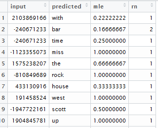
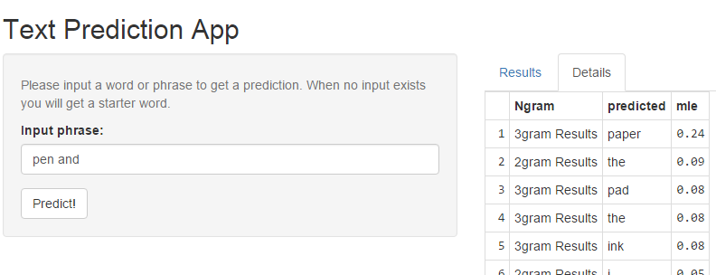

## Introduction

For the Coursera Capstone we partnered with the makers of the [Swiftkey](https://swiftkey.com/en) keyboard app to develop a prediction model for text input. 

The process of building the solution was quite difficult as we had to apply many concepts from previous courses to text data (instead of continuous, numeric values).

--- .class #id 

## The Approach

I utilized the simple but overall fairly accurate back-off approach. According to the Markov Assumption - an accurate prediction model can be obtained by looking at just a few of the preceding words. I created datasets for uni-, bi-, tri- and quadgrams and used their Maximum Likelihood Estimates to decide which word(s) to predict.

Sample code:
```{r eval=F}
dfm.3.summ <- merge(dfm.3.summ, dfm.2.summ[ ,c("freq.x", "word")]
                    , by.x = "input", by.y = "word", all.x = TRUE)
dfm.3.summ <- mutate(dfm.3.summ, mle = freq / freq.x)
dfm.3.pred <- transmute(dfm.3.summ
                        , input = hash(input)
                        , predicted = predicted #column renamed in a previous step
                        , mle = mle)
```

--- .class #id

## The "Predict" Data Frame

Here is a sample of the dataframe used to predict tri-gram results. The "input" column represents the hashed value of the two-word input phrase, followed by the predictions, their respective MLE values and a ranking of the MLE by input.



--- .class #id

## The App
Functions by hashing input and, depending on length of input performs sequential look-ups on the n-gram tables. A results pane for the single best prediction is shown and also a "Details" panel shows all of the possible results. Useful for my fellow Students who might want to see more than just one word.



--- .class #id


## Food For Thought

It would have been wise to implement smoothing and weighting of the probabilities to potentially return more usable results. Also it was difficult to systematically assess the accuracy of the model. I used random input phrases to gauge the results but was not able to fully quantify the accuracy.

Thank you for your constructive input - best of luck in the future!

[Github](https://github.com/ATidmore/Coursera_Capstone)
[Shiny](https://atidmore.shinyapps.io/Coursera_Capstone/)

